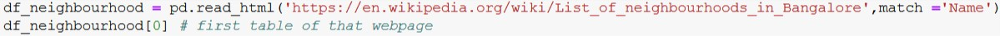
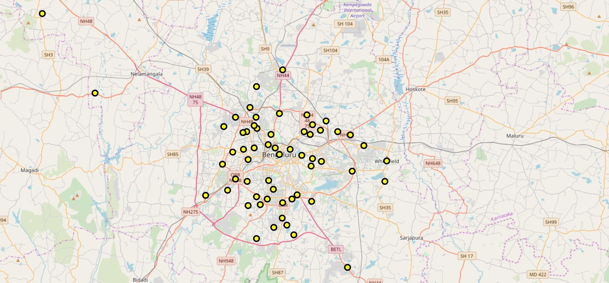
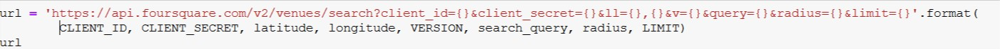
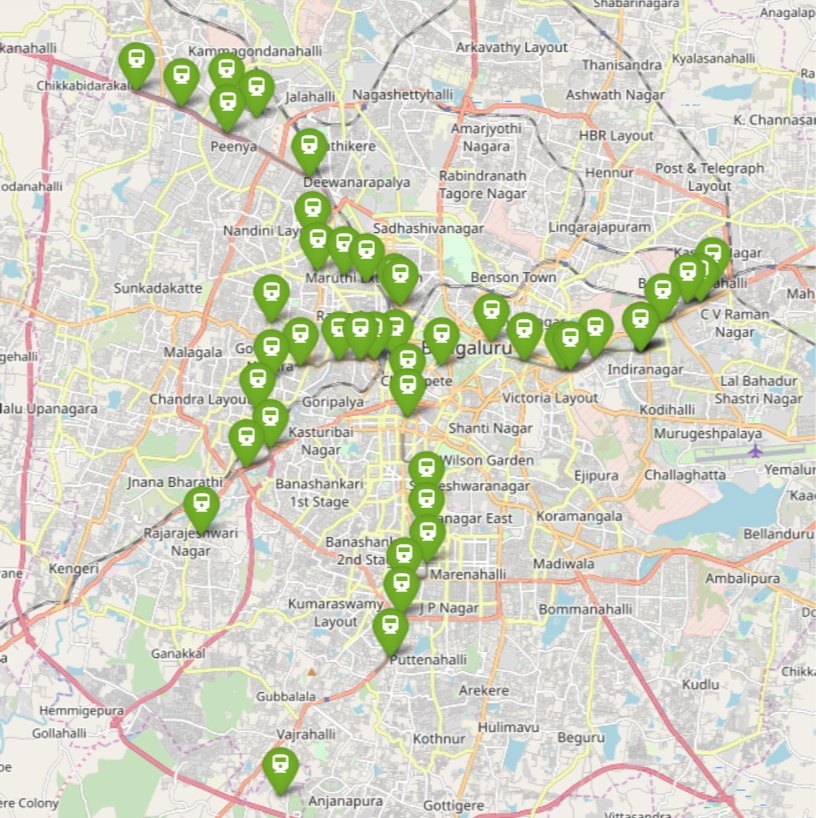
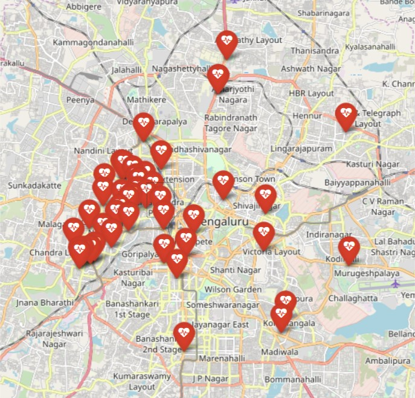
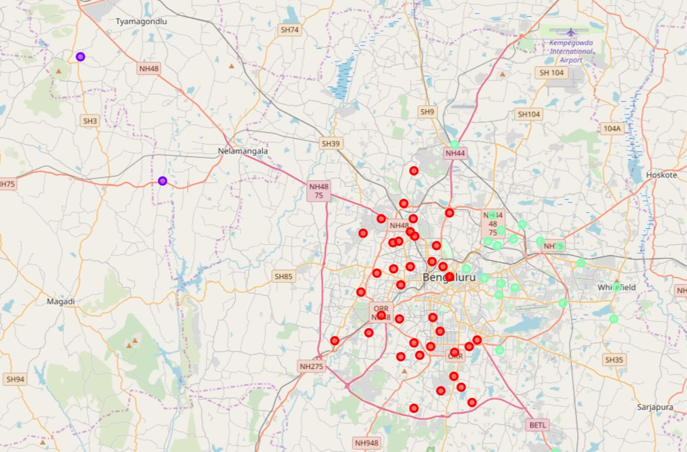
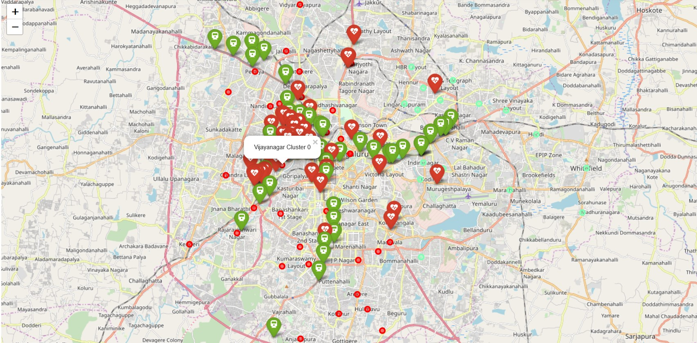
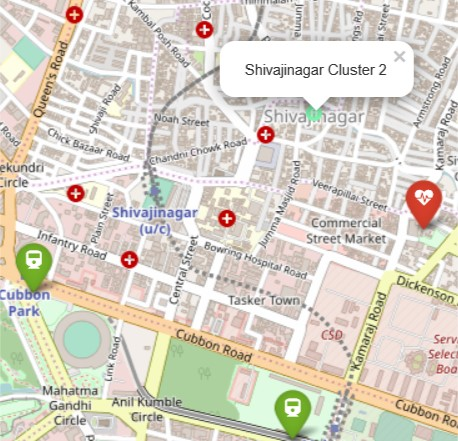
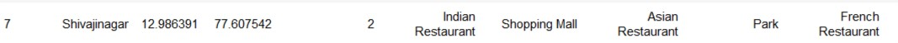
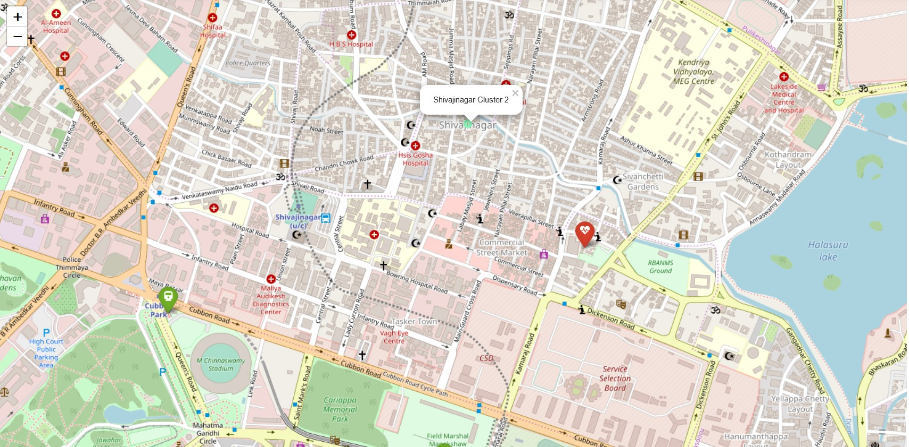

#               Ideal Place to Live In Banglore

Bangalore, officially known as Bengaluru, is the capital of the Indian state of Karnataka. It has a population of over ten million,making it a megacity and the third-most populous city and fifth-most populous urban agglomeration in India.Bangalore is the second fastest-growing major metropolis in India.

Bengaluru has one of the most highly educated workforces in the world. The city attracts thousands of software engineers and IT specialists from all over India. Bengaluru is not just an IT Hub but it is also the hub of other industries like aeronautics, space research and defence research.

# Idea

Bangalore is known as the Silicon Valley of India. With the increasing number of tech comapnies and startups, a lot of people are shifting to Bengaluru. People faces a lot of problems when they shift from one city to another like which is the ideal place that is near to Mall, Hospitals , restaurants, parks, metro station etc.

**Statement:- Which is the suitable area to get all these features nearer in Bangalore?**

# Interest

- People who migrate to Bangalore for a job purpose to stay.

- Finding a suitable location for living.

- Open a business near to between a Metro station and Hospital

# Data Sources

Bangalore data that contain neighbourhoods that is taken from given [link](https://en.wikipedia.org/wiki/List_of_neighbourhoods_in_Bangalore). And other data are extract by using foursquare API.

# Data cleaning

 Data downloaded or scraped from the given link and combined into a table. There is no need for the Image and Summary table, so drop them. Now the remaining table has the name of Neighbourhoods of Bangalore.
 

  Using the **geopy** library to extract the location of each neighbourhood in Bangalore and them into the neighbourhood table. If any error occurs during extracting location then check manually and replace them otherwise drop the neighbourhood. Plot the location of neighbourhoods to visualize the data using **folium** library.
   
 
    
There is an API platform called foursquare API to send requests for query and in return get JSON file of servers.  

   Let use the foursquare API to get Metro Stations in Bangalore.  After getting JSON file of metro stations, extract the category of each metro stations with their location. On the dataset, extract the name of metro stations, latitude and longitude and assign them into a new table. There is a different category of metro stations or the name of a cafe using metro station keyword. Let drop the rows from the table and reset their index. Visualize using folium library 
   
     
     
   Now use the same technique again and search for Hospitals in Bangalore. There is a similar process to extract to name, categories and location. There are many unwanted names in which they are not hospitals just cafe or something else. So, drop these name from table and reset there index.
   
   
  
   Another task of these project to find the venues i.e. 'Shopping Malls, Parks and Restaurants' in each neighbourhood. So, to search these data we use foursquare API and these time we will change the URL.
   To do so we replace the 'search' with the 'explore'. Now send the requests with the help of **requests** library and get the JSON file for all venues in each neighbourhood of Bangalore Bangalore.
     From the JSON file our venues present in the response of venues key attributes. Then normalize the JSON file into a data frame. So, we get all the venues in each neighbourhood. Now our task is to extract the required venues data from dataframe. To do this we apply **contain** method for each venue name on venue category series and assign them into a variable called dataframe of mall, dataframe of parks and datframe of restaurants. All these dataframe combines into one dataframe called as dataframe of required venues.
  
# Feature Selection
  
- For visualizing name and location of each neighbourhood.
- There is only requirements of name and location in Metro stations as well as Hospitals dataframe.
- The required venues dataframe convert into one hot variable i.e. the technique of converting a categorical variable into a numerical variable. Then find the top 10 categories in each neighbourhood. To get these use groupby method and groupby apply on column Neighbourhood also density of each category in neighbourhood i.e. mean of each category. Arrange the dataframe into their top order and name the dataframe grouped mean dataframe.

# Exploratory Data Analysis

The task is to categorize venues items into groups. To achieve this, we will use the kMeans algorithm; an unsupervised learning algorithm.
**KMeans Algorithm**  will categorize the items into k groups of similarity. To calculate that similarity, we will use the euclidean distance as measurement.
Let make groups of 3 most common venues. Firstly we drop the Neighbourhood feature from the grouped mean table and apply **Unsupervised Machine Learning Algorithm** i.e. **KMeans Algorithm**. After fitting the data into the algorithm we get labels called cluster labels. Cluster labels show group no. Assign each label to the grouped mean table and also merged the neighbourhood table into it.
After merging now there are 4 features is add into the grouped mean table. The features are  Neighbourhood, Latitude, Longitude and Cluster_Labels.
Let visualizes the table using **folium** library.

After visualizing we get 3 groups-
 1. Red : cluster Label 0
 * Description: This is Topmost common venues of Indian and Italian Restaurants with Shopping Malls.*
 
 2. Purple: cluster Label 1
 * Description : Topmost common venues are Restaurants. No shopping mall and parks.*
 
 3. Green: cluster Label 2
 * Description :Topmost common venues of Indian and Asian Restaurants, shopping malls and Parks.*
 
* combine the metro stations, hospitals and venues of each neighbourhood on the map-

# Results

After visualzing -

**SHIVAJINAGAR**, cluster label 2, is the ideal place for living.
     - The distance to the Manjushree Specialty Hospital is 950 Metre walk.
     - The distance to the Cubbon Park Metro Station is 1200 Metre walk.
     

# Discussions

Shivajinagar is the best neighbourhood among all neighbourhoods in Bangalore. It is also closer to the famous spots or highlights of Bangalore like-

- **Chinnaswamy stadium** is 1600 Metre far.
- **Halasuru Lake** one of the biggest lakes in Bangalore, is 2000 Metre far.
    
-  **Cariappa memorial park** is 1100 Metre from Shivajinagar.
-  **Commercial Street** is a shopping province in Bangalore, which is 800 Metre walk far. 

# Conclusions

Finally, to conclude this project, we have got a small glimpse fo how real-life Data science project looks like. I have used some frequently used python libraries to handle JSON file, plotting graphs, and other exploratory data analysis. Use Foursquare API to major boroughs of New York City and their neighborhoods. Potential for this kind of analysis in a real-life business problem is discussed in great detail. Also, some of the drawbacks and chances for improvements to represent even more realistic pictures are mentioned. As a final note, all of the above analyses is depended on the adequacy and accuracy of Four Square data. A more comprehensive analysis and future work would need to incorporate data from other external databases.

